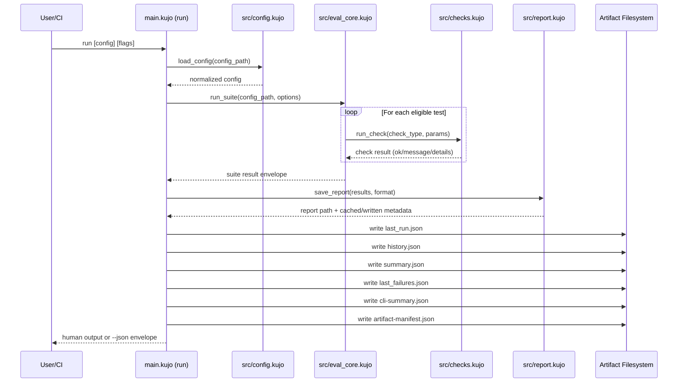
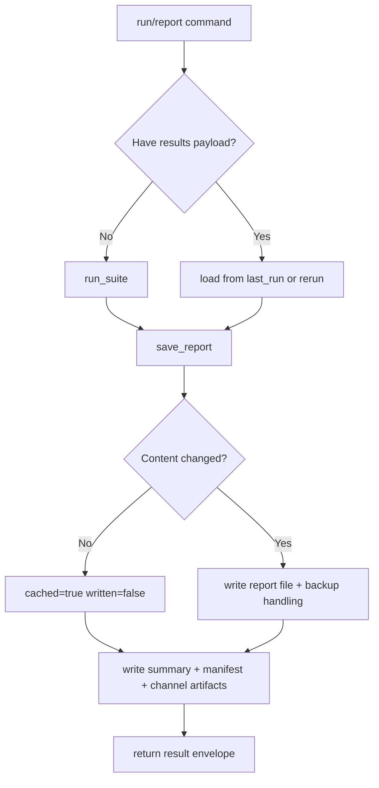
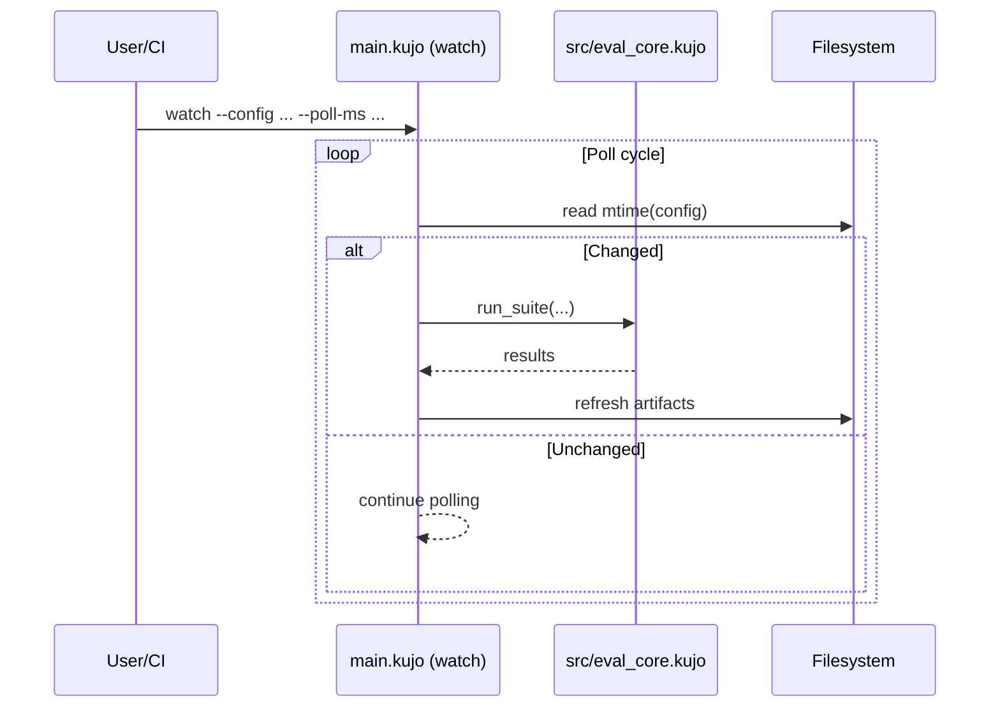

# Architecture — Eval

## System Overview

Eval is a deterministic evaluation engine for agent and workflow outcomes. The architecture is centered on a single suite contract (`eval.json`), a deterministic run engine, and artifact-first outputs for CI automation.

Core goals:

- deterministic test execution and result accounting
- policy-first command/path/env safety controls
- reproducible artifacts for downstream automation
- contract-stable JSON envelopes for integrations

## Core Components

| Component | Responsibility | Primary Files |
|---|---|---|
| CLI entrypoint | Command dispatch and artifact orchestration | `main.kujo`, `src/cli.kujo` |
| Config loader | Parse, normalize, validate suite contract | `src/config.kujo`, `schema/eval-suite.schema.json` |
| Evaluation engine | Execute tests, retries/dependencies, result accounting | `src/eval_core.kujo` |
| Check runtime | Assertion implementations and command/file safety | `src/checks.kujo` |
| Report renderer | Markdown/HTML/JUnit/TAP/NDJSON generation + caching | `src/report.kujo` |
| Snapshot manager | Snapshot store, compare, lifecycle helpers | `src/snapshot.kujo` |

## Run Lifecycle



### Parallel Execution Path (C1)

`run_suite` supports opt-in parallel mode for independent file checks (`file_exists`, `file_does_not_exist`, `file_contains`, `file_does_not_contain`) via `parallel_workers > 1`.

Key characteristics:

- deterministic ordering is preserved in final `test_results`
- dependency, retry, and hook constraints force safe serial fallback
- parallel metadata is emitted in result payloads and reports:
  - `parallel_requested`
  - `parallel_used`
  - `parallel_mode`
  - `parallel_workers`
  - `parallel_fallback_reason`
  - `parallel_prefetched_files`
  - `parallel_prefetch_duration_ms`

## Report Lifecycle



## Watch Lifecycle



## Artifact Contract

Primary artifacts generated by `run`:

- `eval-report.<ext>`
- `last_run.json`
- `history.json`
- `summary.json`
- `last_failures.json`
- `cli-summary.json` (or `--summary-channel-path`)
- `artifact-manifest.json` (optional checksum block with `--artifact-checksums`)

Integrity flow:

1. `run` / `report` writes `artifact-manifest.json`
2. Optional checksum mode adds `sha256` entries
3. `verify-manifest` recomputes digests and fails on mismatch

## Fixture-Heavy Performance Probe

To detect I/O regression drift beyond lightweight smoke suites, Eval includes a fixture-heavy suite:

- `examples/io_heavy_regression_suite.json`

This suite exercises larger file and directory checks, JSON shape checks, and command checks in one run so report and manifest payloads stay regression-tested under heavier artifact output.

Recommended probe command:

```bash
kujo run main.kujo run examples/io_heavy_regression_suite.json --output-dir .eval_perf_probe --json
```

Release quality gates consume this fixture as part of benchmark budget enforcement to catch unexpected runtime growth early.

## Safety And Policy Enforcement

Security controls are enforced at check runtime and config boundaries:

- command allowlists and pattern constraints
- blocked command argument patterns
- path traversal and sensitive directory restrictions
- output redaction for sensitive token patterns
- config normalization/size limits and max test counts

Stage overlays:

- base policy can be refined per stage via `policy_stage_overlays`
- `--policy-stage` / `KUJO_EVAL_POLICY_STAGE` selects overlay
- active stage is surfaced in `active_policy_stage`

## Determinism Guarantees

Determinism is preserved by:

- stable test ordering unless explicit seed shuffle is requested
- deterministic dependency skip behavior
- deterministic summary/manifest/channel artifact generation
- report caching for unchanged payloads
- parity script coverage for primary documented command paths

## Extension Points

To add a new check:

1. implement check handler in `src/checks.kujo`
2. register in dispatcher (`run_check`)
3. add to `KNOWN_CHECKS` in `src/config.kujo`
4. update schema enum and docs
5. add contract + integration coverage in `tests/`

To add a new output/report flow:

1. add generator in `src/report.kujo`
2. wire format handling in save/print paths
3. update CLI help and docs parity script
4. add coverage tests for output structure and persistence behavior
